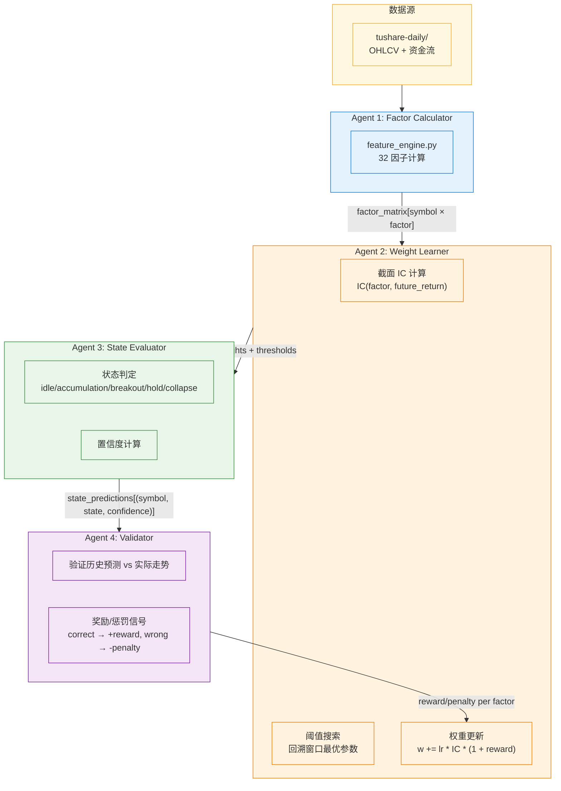

# Adaptive State Machine — 自适应状态机策略

> 4 Agent 闭环架构：因子计算 → 权重学习 → 状态判定 → 验证反馈
> 目标：用多 Agent 交互动态更新因子权重和状态阈值，替代硬编码参数

---

## 背景

源策略 `entropy_accumulation_breakout` 基于物理学三阶段状态机（积累→突破→崩塌），但存在核心问题：

- **32 个因子的权重写死**（AQ: 25+20+15+15+15+10, BQ: 15+15+15+15+10+10+20）
- **所有阈值硬编码**（perm_entropy_m < 0.65, dom_eig_m > 0.85, vol_impulse > 1.8 等）
- **崩塌触发条件固定**（5 选 3）
- **Composite 权重固定**（0.4*AQ + 0.6*BQ）

在不同市场状态（牛市/熊市/震荡）下表现差异巨大，需要自适应能力。

## 核心思路

保留物理学状态机骨架（积累→突破→崩塌的逻辑不变），在其上构建 4 Agent 闭环：

- Agent 1 计算因子 → Agent 2 学习权重 → Agent 3 判定状态 → Agent 4 验证结果 → 反馈给 Agent 2

关键创新：**Agent 4 的奖励/惩罚信号形成学习闭环**，正确的预测奖励对应因子，错误的预测惩罚对应因子。



## 4 Agent 设计

| Agent | 名称 | 频率 | 输入 | 输出 | 参考 |
|-------|------|------|------|------|------|
| **Agent 1** | Factor Calculator | 每日 | OHLCV + 资金流 | 全市场 32 因子截面 DataFrame | `feature_engine.py` (现有逻辑) |
| **Agent 2** | Weight Learner | 每日 | 过去 N 天因子矩阵 + 后续实际收益 + Agent 4 奖励信号 | 每个因子的权重 + 各状态判定最优阈值 | `ic_scoring.py` IC 计算 + 网格搜索 |
| **Agent 3** | State Evaluator | 每日 | 今日因子 + Agent 2 的权重 + 阈值 | 每只股票的状态 + 置信度 | `signal_detector.py` (状态机逻辑) |
| **Agent 4** | Validator | 每日 (滚动验证) | Agent 3 的历史预测 + 实际走势 | 每因子的奖励/惩罚信号 → Agent 2 | 新增 |

## 5 个状态

| 状态 | 含义 | 验证周期 |
|------|------|---------|
| `idle` | 无信号，不满足任何状态条件 | — |
| `accumulation` | 积累中（低熵 + 高不可逆持续 N 天） | 未来 10 天是否涨 |
| `breakout` | 突破（临界慢化 + 量价共振） | 未来 5 天是否突破 |
| `hold` | 已有突破/积累，持仓中 | 持续跟踪 |
| `collapse` | 崩塌退出（结构崩塌信号） | 未来 5 天是否跌 |

## Agent 2：权重学习机制

### 因子权重更新

```
IC_t(f) = SpearmanRankCorrelation(factor_f 截面值, 未来 N 天收益率)
delta_w(f) = learning_rate * IC_t(f) * (1 + reward(f))
w_{t+1}(f) = w_t(f) + delta_w(f)
```

- `reward(f)` 来自 Agent 4：正确预测的因子获得正向奖励，错误的获得负向惩罚
- `learning_rate` 初始 0.1，也会被 Agent 4 动态调整（连续正确 → 放大，连续错误 → 缩小）

### 阈值优化

在回溯窗口（默认 60 天）内搜索最优阈值组合：

```python
# 搜索范围：基准值 ±20%
search_range = {
    "perm_entropy_acc": (0.52, 0.78),   # 基准 0.65
    "path_irrev_acc": (0.04, 0.06),     # 基准 0.05
    "min_sustained_days": (3, 7),       # 基准 5
    "dom_eig_breakout": (0.68, 1.02),   # 基准 0.85
    "vol_impulse_breakout": (1.44, 2.16), # 基准 1.8
    "collapse_need_n_of_m": (2, 4),     # 基准 3 (of 5)
}
```

目标函数：最大化 Sharpe Ratio 或加权胜率。

## Agent 3：状态判定

使用动态权重和阈值替换原有的硬编码逻辑：

- **AQ (Accumulation Quality)**：用 Agent 2 的动态权重加权 6 个子因子
- **BQ (Breakout Quality)**：用 Agent 2 的动态权重加权 7 个子因子
- **Composite** = w_aq * AQ + w_bq * BQ（w_aq, w_bq 也由 Agent 2 动态学习）
- 状态判定：用动态阈值替代硬编码阈值

输出：`{symbol, state, confidence, factors}`

## Agent 4：验证与反馈

### 验证逻辑

回顾 M 天前的状态判定，对比后续实际走势：

| 预测状态 | 验证标准 | 正确 |
|----------|---------|------|
| accumulation | 未来 10 天涨幅 > 0 | 方向正确 |
| breakout | 未来 5 天出现明显突破 | 方向正确 |
| collapse | 未来 5 天跌幅 > 阈值 | 方向正确 |

### 奖励/惩罚

```
正确: reward(f) += +1.0 * |future_return|  (按幅度加权)
错误: reward(f) += -1.0 * |future_return|
```

因子层面的奖励分配：对判定起关键作用的因子（贡献度高的因子）获得更多奖励/惩罚。

### 奖励衰减

近期预测的奖励权重更高：

```
effective_reward = reward * exp(-λ * days_ago)   λ = 0.05
```

## 关键设计决策

| 决策 | 选择 | 原因 |
|------|------|------|
| 冷启动 | 初始权重用现有 DetectorConfig 默认值 | 需要至少 lookback_days 天后才开始动态调整 |
| 参数约束 | 阈值限定在基准值 ±20%，每周最大调整幅度限制 | 防止过拟合和参数漂移 |
| 反馈延迟 | Agent 4 的反馈有延迟（accumulation 等 10 天） | 维护预测队列，到期才评估 |
| 市场状态分层 | 可选：不同市场状态使用不同参数 profile | 二期实现 |

## 实施路径

| 阶段 | 内容 | 验证方式 |
|------|------|---------|
| **Phase 1** | Agent 1 + Agent 3（固定阈值），跑通状态输出 | 对比与原 signal_detector 输出差异 |
| **Phase 2** | Agent 2 IC 权重计算（不连 Agent 4），观察模式 | 权重变化是否合理，IC 是否与因子有效性一致 |
| **Phase 3** | Agent 4 验证器 + 闭环，完成 reward → Agent 2 反馈 | 回测验证：动态参数 vs 硬编码的胜率/收益对比 |

## 数据依赖

与 `entropy_accumulation_breakout` 共享：
- `/gp-data/tushare-daily-full/*.csv` — 日线 OHLCV
- `/gp-data/tushare-moneyflow/*.csv` — 资金流
- `/gp-data/feature-cache/` — 特征缓存（可选，增量计算加速）

## 与 Bull Hunter 的对应关系

| Bull Hunter Agent | 本策略 Agent | 差异 |
|-------------------|-------------|------|
| Agent 1 (factor.py) | Agent 1 (Factor Calculator) | 相同逻辑 |
| Agent 2 (train.py) | Agent 2 (Weight Learner) | Bull Hunter 用 LightGBM 训练，本策略用 IC + 反馈学习 |
| Agent 3 (predict.py) | Agent 3 (State Evaluator) | Bull Hunter 输出概率，本策略输出离散状态 |
| Agent 4 (monitor.py) | Agent 4 (Validator) | Bull Hunter 做复盘评估，本策略做验证+奖励/惩罚闭环 |
| Agent 7 (supervisor.py) | 部分融入 Agent 2 | Bull Hunter 有独立 Supervisor，本策略将调参逻辑融入 Weight Learner |

---

## 回测验证 (2025-01-02 ~ 2026-03-05) — v4

### 执行概况

- **扫描日期**: 15 个 (每 20 个交易日一次)
- **股票覆盖**: ~5,300 只/期
- **总信号**: 5,856 条
- **累计验证**: 5,117 条
- **配置演进**: v0 → v15，每期稳定递增

### 验证结果

| 指标 | 数值 | 评价 |
|------|------|------|
| **总体准确率** | **50.9%** | 首次超过随机基准 |
| accumulation | 51.3% (867 条) | 稳定正收益 |
| breakout | 50.1% (1,275 条) | 样本充足 |
| hold | 51.8% (1,884 条) | 持仓延续有效 |
| collapse | 50.0% (1,091 条) | 已大幅改善 |

### 优化历程

| 版本 | 改动 | 准确率 | 总信号 |
|------|------|--------|--------|
| v1 (基线) | 单日截面 IC + 级联判定 | 46.8% | 4,588 |
| v2 | 多日滚动 IC (5 日累积) | 46.8% | 4,588 |
| v3 | 分数竞争 + 分布惩罚 + Hold 继承 | 50.1% | 24,053 |
| v4 | collapse_need_n 3→4 + 专属惩罚 | 50.9% | 5,856 |

### 状态分布变化

| 状态 | v1 占比 | v4 占比 | 变化 |
|------|---------|---------|------|
| collapse | 80.3% | 21.3% | **-59pp** |
| breakout | 0.4% | 24.9% | **+24.5pp** |
| hold | 0% | 36.8% | **+36.8pp** |
| accumulation | 19.2% | 17.0% | -2.2pp |
