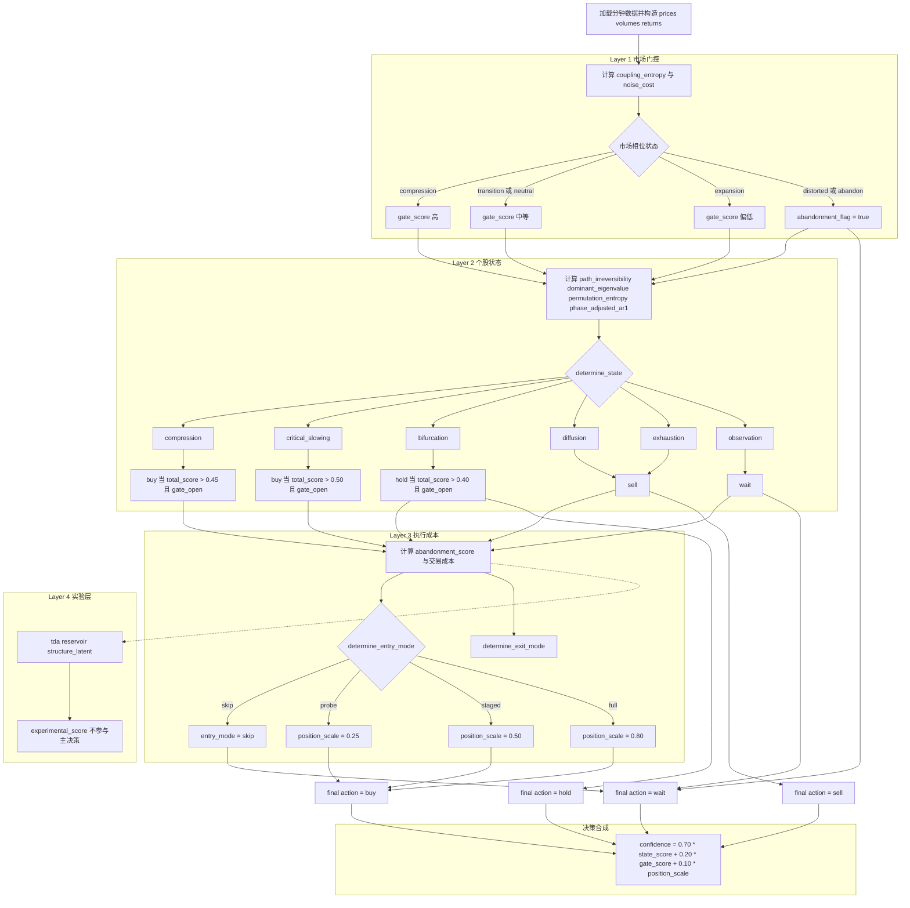

# Continuous Decline Recovery

## 描述

这个策略专门解决一个更具体的问题：当整个市场经历了一段连续下跌后，什么时候不是去抄“最低点”，而是去买“最先修复的一段”。

它不是从 `entropy_bifurcation_setup` 继承出来的变体，而是单独重写的一套三层结构：

1. 市场层：先判断最近窗口里是否真的发生过连续下跌，再判断当前是否进入修复买点。
2. 板块层：只排那些“先受伤、再修复、且相对市场更早转强”的行业。
3. 个股层：只选“前期受压明显、当前刚进入修复窗口、量能与资金开始配合、但还没反弹过热”的股票。

一句话概括，这个策略不是买在最恐慌的时候，而是买在“连续下跌后的第一段可持续修复”里。

## 四层熵系统状态流转与决策合成图

下面这张图描述的是 `four_layer_entropy_system` 的实际代码路径，放在这里作为和当前三层修复策略对照阅读的参考。



## 12 篇论文指标映射表

| 论文 | 市场层 | 板块层 | 个股层 | 本策略中的落地指标 |
| --- | --- | --- | --- | --- |
| [Entropy Production Rate in Stochastically Time-evolving Asymmetric Networks](../../../docs/papers/entropy_time_evolving_networks.pdf) | 关注市场整体耦合与修复广度，而不是只看指数点位 | 看行业内部是否同步修复、是否出现相对强度领先 | 不直接做单票主信号 | `repair_share`、`early_entry_share`、`sector_relative_strength_5` |
| [Universal bounds on entropy production from fluctuating coarse-grained trajectories](../../../docs/papers/entropy_bounds_coarse_grained.pdf) | 承认只能在粗粒化日线上做不可逆性代理，不追求“真实熵” | 行业层用横截面修复占比做代理 | 个股层用受损程度和修复程度代理“路径不可逆性” | `damage_score`、`repair_score`、`base_candidate_flag` |
| [Near-optimality of conservative driving in discrete systems](../../../docs/papers/conservative_driving_discrete.pdf) | 市场层不追求一次性打满仓，而是分状态执行 | 板块层只给领先方向更高权重，不做复杂轮动路径优化 | 个股层用保守建仓替代理论最优控制 | `entry_mode`、`position_scale`、`staged_entry_days` |
| [Topological Detection of Hopf Bifurcations via Persistent Homology](../../../docs/papers/hopf_bifurcation_persistent_homology.pdf) | 更适合作为实验层，不适合当前主买点 | 可用于未来识别行业振荡回环 | 不进入当前主选股逻辑 | 当前版本不落地主信号，保留为后续实验方向 |
| [Predicting the onset of period-doubling bifurcations via dominant eigenvalue extracted from autocorrelation](../../../docs/papers/period_doubling_dominant_eigenvalue.pdf) | 强调“临界切换前的修复启动”而不是单纯超跌 | 行业层更看谁先从弱转强 | 个股层落到早期修复窗口而不是过晚追涨 | `entry_window_score`、`rebound_from_low_10`、`ret_3` |
| [Ultra-Early Prediction of Tipping Points: Integrating Dynamical Measures with Reservoir Computing](../../../docs/papers/tipping_points_reservoir_computing.pdf) | 更适合做市场门控而不是直接选股 | 可辅助观察行业是否进入拐点 | 不适合作为单票主因子 | 当前版本把它的思想落成 `market_buy_state`，不直接上 RC 模型 |
| [Scrambling at the genesis of chaos](../../../docs/papers/scrambling_genesis_chaos.pdf) | 防止把局部反弹误判成系统性修复 | 行业层避免追假强势 | 个股层要过滤高波动、高过热状态 | `market_overheat_score`、`sector_overheat_score`、`overheat_score` |
| [Beyond the Largest Lyapunov Exponent: Entropy-Based Diagnostics of Chaos](../../../docs/papers/entropy_based_diagnostics_chaos.pdf) | 更重视全市场分布与宽度，而不是单一路径 | 更重视行业整体修复一致性 | 个股层加入稳定性约束，而不是只看弹性 | `repair_share`、`sector_entry_share`、`stability_score` |
| [Communication-Induced Bifurcation and Collective Dynamics in Power Packet Networks](../../../docs/papers/communication_induced_bifurcation_power_packet.pdf) | 高噪声阶段要学会不买或少买 | 板块层不强迫轮动，允许空仓等待 | 个股层在市场不允许时直接 `skip` | `market_buy_state`、`market_can_buy`、`execution_cost_state` |
| [Comparing Physics-Informed and Neural ODE Approaches for Modeling Nonlinear Biological Systems](../../../docs/papers/pinn_vs_neural_ode_morris_lecar.pdf) | 支持显式结构化规则而不是黑盒预测 | 板块层直接给出可解释排序 | 个股层显式拆成受损、修复、资金、稳定性几部分 | `sector_score`、`damage_score`、`flow_support_score` |
| [A Comparative Investigation of Thermodynamic Structure-Informed Neural Networks](../../../docs/papers/thermodynamic_structure_informed_neural_networks.pdf) | 支持分层建模而不是一层总分 | 行业层和个股层各自承担不同约束 | 单票评分按结构拆解，而不是一个黑箱分数 | `market_buy_score`、`sector_score`、`strategy_score` |
| [Statistical warning indicators for abrupt transitions in dynamical systems with slow periodic forcing](../../../docs/papers/statistical_warning_indicators_abrupt_transitions.pdf) | 提醒不要迷信单一 early warning 指标 | 行业层不要只看单日转强 | 个股层强调连续修复和不过热窗口 | `market_window`、`repair_flag`、`early_entry_flag`、`overheat_flag` |

## 具体规则

### 1. 市场买点

市场层只回答一个问题：现在到底能不能开始买“跌后修复”这件事。

连续下跌的前提由四类横截面指标共同定义：

1. 近 10 个交易日等权收益明显走弱。
2. 大量股票仍在 20 日均线下方。
3. 大量股票距离 20 日高点已有明显回撤。
4. 近一周负收益天数密集，说明不是横盘而是真跌过一段。

在这个前提上，再看修复是否成立：

1. 修复广度上升：更多股票重新站回 5 日线并出现 3 日正收益。
2. 早期入场占比上升：更多股票刚从 10 日低点反弹，但还没涨到过热区。
3. 资金与量能回流：`flow_ratio_5` 和 `amount_ratio_20` 同时改善。
4. 过热比例不能太高：如果市场已经大面积反弹过头，就不再算最佳买点。

最终市场状态只有五个：

1. `no_setup`：最近没有足够明显的连续下跌，不做跌后修复策略。
2. `selloff`：下跌还没结束，不买。
3. `repair_watch`：修复刚开始，只允许试探。
4. `buy_window`：连续下跌后的最佳买入窗口。
5. `rebound_crowded`：修复已经走太快，停止追价。

### 2. 板块排序

板块不是按跌幅排序，而是按“受损后修复质量”排序。行业得分由六部分组成：

1. 行业平均受损程度：前期是否真被打下来。
2. 行业平均修复程度：现在是否真的在恢复。
3. 行业候选股占比：内部有多少股票已经进入早期买点区。
4. 行业资金支持：量能和资金回流是否一致。
5. 相对市场强度：行业 5 日收益是否领先市场。
6. 过热惩罚：反弹太多就降分。

只有行业成员数足够、板块得分达标、且排名进入 `top_sectors` 的行业，才会进入个股筛选层。

### 3. 个股入选

个股只在“市场允许 + 板块领先”的前提下入选。单票至少同时满足：

1. 前期受损足够明显：`damage_score >= 0.32`。
2. 当前修复已经成立：`repair_score >= 0.48`。
3. 还处于早期窗口：`entry_window_score >= 0.40`。
4. 量能和资金支持不弱：`flow_support_score >= 0.35`。
5. 从 10 日低点反弹幅度落在 `[min_rebound_from_low, max_rebound_from_low]`。
6. 不在明显过热区。

最终个股总分 `strategy_score` 综合了受损、修复、窗口、资金、稳定性、板块加分和相对板块强度，再减去过热惩罚。

### 4. 执行规则

执行层采用保守模式，而不是一次性梭哈：

1. `repair_watch`：只允许 `probe`，小仓试探。
2. `buy_window` 且总分很高：允许 `full` 或 `staged`。
3. 市场不允许时：直接 `skip`。
4. 流动性不足、量能不跟或波动过大时：`execution_cost_state=cautious/blocked`。

## 主要参数

- `--scan_date`：扫描日期，格式 `YYYYMMDD`；不传则自动推断最新交易日。
- `--top_n`：输出前 N 只候选股，默认 `30`。
- `--top_sectors`：最多保留多少个领先行业，默认 `6`。
- `--min_amount`：最低成交额过滤，默认 `600000`。
- `--min_turnover`：最低换手率过滤，默认 `1.0`。
- `--exclude_st` / `--include_st`：是否排除 ST 股票，默认排除。
- `--market_window`：市场状态回看窗口，默认 `6` 个交易日。
- `--min_sector_members`：板块最少成分股数量，默认 `4`。
- `--min_rebound_from_low`：从 10 日低点起算的最小反弹幅度，默认 `0.03`。
- `--max_rebound_from_low`：从 10 日低点起算的最大反弹幅度，默认 `0.15`。
- `--backtest_start_date`：滚动前瞻回测起始扫描日，格式 `YYYYMMDD`。
- `--backtest_end_date`：滚动前瞻回测结束扫描日，格式 `YYYYMMDD`。
- `--hold_days`：执行层建议的基础持有周期，默认 `8`。
- `--max_positions`：组合最大持仓数，默认 `10`。
- `--max_positions_per_industry`：单行业最大持仓数，默认 `2`。

## 运行方式

```bash
python src/strategy/continuous_decline_recovery/run_continuous_decline_recovery_scan.py \
  --data_dir /nvme5/xtang/gp-workspace/gp-data/tushare-daily-full \
  --basic_path /nvme5/xtang/gp-workspace/gp-data/tushare_stock_basic.csv \
  --out_dir results/continuous_decline_recovery \
  --scan_date 20260331

python src/strategy/continuous_decline_recovery/run_continuous_decline_recovery_scan.py \
  --data_dir /nvme5/xtang/gp-workspace/gp-data/tushare-daily-full \
  --basic_path /nvme5/xtang/gp-workspace/gp-data/tushare_stock_basic.csv \
  --out_dir results/continuous_decline_recovery \
  --scan_date 20260331 \
  --backtest_start_date 20260115 \
  --backtest_end_date 20260320
```

## 输出文件

- `market_scan_snapshot_<strategy>_<scan_date>.csv`：扫描日全市场快照。
- `sector_ranking_<strategy>_<scan_date>.csv`：行业排序结果。
- `<strategy>_candidates_<scan_date>_all.csv`：全部候选股。
- `<strategy>_candidates_<scan_date>_topN.csv`：候选股前 N。
- `selected_portfolio_<strategy>_<scan_date>_topN.csv`：叠加行业容量和仓位规则后的最终入选名单。
- `strategy_summary_<strategy>_<scan_date>.csv`：市场买点、候选数、入选数等摘要。
- `forward_backtest_daily_<strategy>_<scan_date>.csv`：滚动前瞻回测的逐日净值、暴露度和当日信号摘要。
- `forward_backtest_trades_<strategy>_<scan_date>.csv`：滚动前瞻回测的逐笔交易结果。
- `forward_backtest_summary_<strategy>_<scan_date>.csv`：滚动前瞻回测汇总指标，包括交易数、胜率、收益和回撤。
- `forward_backtest_yearly_performance_<strategy>_<scan_date>.csv`：按自然年拆分的回测表现表。
- `forward_backtest_interval_performance_<strategy>_<scan_date>.csv`：按 since inception、近 3 年、近 2 年、近 1 年、YTD、近 6 个月、近 3 个月拆分的区间表现表。
