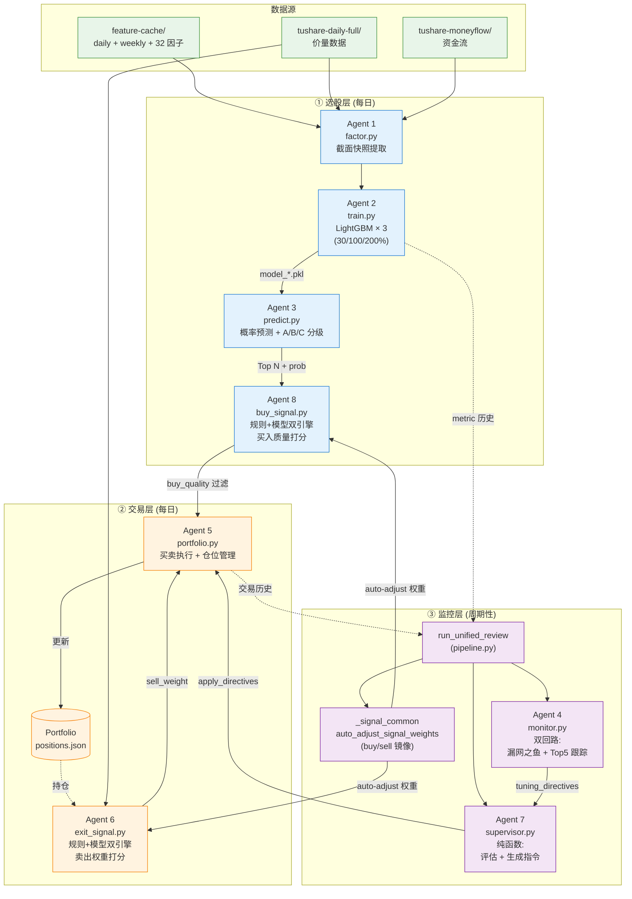

# 因子模型选股 — Pipeline 全景

> 记录三条流水线:
> - (A) 特征缓存三步流水线 (数据预处理)
> - (B) 4-Agent 因子状态机选股流水线 (v2)
> - (C) **Bull Hunter v6 大牛股预测 + 持仓管理流水线** (LightGBM 三分类器 + 6-Agent 三层架构)

---

## 4-Agent Pipeline (v2 因子状态机)

> 代码: `pipeline.py` → `run_pipeline_single()` / `run_pipeline_rolling()`
> **v2 重构**: Agent 2/3 从 LightGBM + 固定持有期 → 因子状态机 + 条件退出

```
Agent 1 (因子快照) → Agent 2 (状态机选股) → Agent 3 (条件退出回测) → Agent 4 (策略分析)
```

| Agent | 文件 | 职责 | 耗时 |
|-------|------|------|------|
| **Agent 1** | `agent_factor.py` | 从缓存提取 scan_date 的全市场因子截面 | ~55-63s |
| **Agent 2** | `agent_selection.py` | 三阶段状态机 (蓄力→突破), 预筛→逐股评估→Top N | ~48s |
| **Agent 3** | `agent_validation.py` | 条件退出回测 (4选≥2 结构崩塌信号, 最大持有天数安全网) | ~0.1s |
| **Agent 4** | `agent_analysis.py` | 有效性判定 + 全市场大牛股捕获分析 + 收益贡献 | ~38s |

**详细文档**:
- [AGENT1_FACTOR.md](AGENT1_FACTOR.md) — 因子加载、过滤、合并
- [AGENT2_SELECTION.md](AGENT2_SELECTION.md) — 因子状态机: 蓄力/突破条件体系
- [AGENT3_VALIDATION.md](AGENT3_VALIDATION.md) — 条件退出: 结构崩塌检测
- [AGENT4_ANALYSIS.md](AGENT4_ANALYSIS.md) — 有效性阈值、大牛股诊断、贡献分析

### v2 vs v1 对比

| 方面 | v1 (LightGBM) | v2 (状态机) |
|------|--------------|------------|
| Agent 2 | 黑盒回归 → 排名 Top N | 白盒因子状态机: 蓄力→突破 |
| Agent 3 | 固定持有期 | 条件退出 + 安全网 |
| 依赖 | 需 train_cutoff, LightGBM | 仅需因子缓存 CSV |
| Agent 2 耗时 | ~110s | ~48s (快 57%) |
| 可解释性 | 低 (模型打分) | 高 (每个条件有物理含义) |

### 滚动模式

```
scan_interval = max(hold_days, user_scan_interval)

3d: 每 3 天扫描 → 12 个扫描日/季度
5d: 每 5 天扫描 → 12 个扫描日/季度
1w: 每 5 天扫描 → 12 个扫描日/季度
3w: 每 15 天扫描 → 4 个扫描日/季度
5w: 每 25 天扫描 → 3 个扫描日/季度
```

---

## 特征缓存三步流水线 (数据预处理)

```
原始行情 CSV → [第一步] feature_engine → daily/weekly 缓存
  → [第二步] factor_profiling → 因子预测力评估
    → [第三步] signal_detector → 选股信号
```

## 旧版备份

| 文件 | 说明 |
|------|------|
| `agent_selection_lgb.py` | v1 LightGBM 选股 (备份) |
| `agent_validation_fixed.py` | v1 固定持有期 (备份) |

---

## Bull Hunter v6 大牛股预测 + 持仓管理流水线

> 代码: `v3_bull_hunter/` 子目录
> 独立于 v2 状态机，目标不同: 找 30%/100%/200% 大牛股 + 全周期持仓管理
>
> 历史: v3 (4-Agent 选股) → v4 (引入 Agent 5/6/7 持仓闭环) → v6 (合并/简化为三层架构)
>
> **完整 Agent 交互图（Mermaid）**: 见 [v3_bull_hunter/README.md](../v3_bull_hunter/README.md#核心思路)

### v6 三层架构



**关键数据流**

| 边 | 频率 | 内容 |
|---|------|------|
| Agent 1 → 2 → 3 | 训练日（默认每周） | 因子 panel → 模型 → 概率 |
| Agent 3 → 8 → 5 | 每日 | Top N → buy_quality 过滤 → 实际下单 |
| Agent 6 → 5 | 每日 | 持仓的 sell_weight，触发卖出 |
| Agent 4 → 7 → 5 | 复盘日（默认每 N 天） | 选股层调参指令 |
| `_signal_common` → 6/8 | 复盘日 | Spearman 自适应权重 |

**Agent 交互矩阵**

```
发出方 →    Agent 1    Agent 2    Agent 3    Agent 8    Agent 5    Agent 6    统一复盘
接收方 ↓   (因子)     (训练)     (预测)    (买入信号)  (组合)     (退出)     (4+7合并)
───────────────────────────────────────────────────────────────────────────────────────
Agent 1      —
Agent 2    snapshot     —                                                  L1调参指令
Agent 3               model_dir    —
Agent 8    snapshot               candidates    —
Agent 5                                      filtered     —      sell_wt   参数调整
Agent 6    snapshot                                      trades    —       参数调整
统一复盘   snapshot              predictions   quality   trades   accuracy    —
```

**每日 Live 循环时序**

```
  时间轴 →

  Agent 1        Agent 3        Agent 8         Agent 6        Agent 5
    │              │              │               │              │
    │─ 因子快照 ─►│              │               │              │
    │  snapshot    │              │               │              │
    │              │─ Top N ────►│               │              │
    │              │  candidates  │               │              │
    │──── snapshot ────────────►│               │              │
    │              │              │─ filtered ──►│              │
    │              │              │  (quality≥0.3)│              │
    │              │              │               │─sell_weight─►│
    │              │              │               │  对已持仓    │
    │              │              │               │              │─ 先卖后买
    │              │              │               │              │  完成交易
    ▼              ▼              ▼               ▼              ▼
```

### Agent 一览

| Agent | 文件 | 层 | 职责 |
|-------|------|----|------|
| **Agent 1** | `agent1_factor.py` | 选股 | 从缓存提取 scan_date 的全市场因子截面 (32 因子) |
| **Agent 2** | `agent2_train.py` | 选股 | 构建训练 panel + 训练 3 个 LightGBM 二分类器 (30%/100%/200%) |
| **Agent 3** | `agent3_predict.py` | 选股 | 全市场概率预测 + A/B/C 分层评级 |
| **Agent 8** | `agent8_buy_signal.py` | 选股 | 买入质量过滤: 在 Top N 中再做规则+模型双引擎打分 |
| **Agent 5** | `agent5_portfolio.py` | 交易 | 买卖执行: 接收 Top N + sell_weights, 管理组合 |
| **Agent 6** | `agent6_exit_signal.py` | 交易 | 计算每只持仓的 sell_weight, 训练卖出模型 |
| **Agent 4** | `agent4_monitor.py` | 监控 | 双回路: 漏网之鱼分析 + Top 5 跟踪, 反馈给 Agent 1/2/3 |
| **Agent 7** | `agent7_supervisor.py` | 监控 | 纯函数集: 评估 + 生成指令 (供 run_unified_review 调用) |
| **公共** | `_signal_common.py` | 共享 | Agent 6/8 公共 IO + auto_adjust + 快照逻辑 (买卖镜像) |

### v6 三个预测目标 (Agent 2/3)

| 目标 | 标签定义 | 前瞻窗口 | 分级 |
|------|---------|---------|------|
| `30pct` | 涨幅 ≥ 30% | 10 个交易日 (2 周) | C 级 |
| `100pct` | 涨幅 ≥ 100% | 40 个交易日 (2 月) | B 级 |
| `200pct` | 涨幅 ≥ 200% | 120 个交易日 (6 月) | A 级 |

### Agent 2 训练关键设计

- **训练数据**: 回看 12 个月, 每 5 天采样, 构建 (stock × date) panel (~10 万~24 万行)
- **标签**: `gain_Nd >= threshold` → 1, 正样本极稀少 (< 1%)
- **LightGBM**: 800 树, lr=0.03, max_depth=5, scale_pos_weight ≤ 5.0
- **不用 Early Stopping**: 极端不平衡下 val loss 从第 1 棵树单调递增
- **F1 最优阈值搜索**: [0.01, 0.50], 正样本稀少时固定 0.5 不合理
- **向量化 panel 构建**: pd.merge 替代三重循环, 10+ 分钟→1 秒

### Agent 3 评级逻辑

```
A 级 (大牛股): prob_200 > best_threshold_200
B 级 (翻倍股): prob_100 > best_threshold_100 (且不是 A 级)
C 级 (短线强势): prob_30 > best_threshold_30 (且不是 A/B 级)
```

### Agent 6/8 自适应权重 (auto_adjust)

两个 Agent 镜像对称, 公共逻辑在 `_signal_common.auto_adjust_signal_weights()`:

- **方向**: buy → sign=+1 (因子与未来收益正相关加权); sell → sign=-1
- **算法**: Spearman 相关性, lr=0.3, 权重 clip [0.01, 0.25], 最少 10 样本
- **触发**: 由 `run_unified_review` 周期性调用 (默认每 N 个交易日)
- **持久化**: `rule_weights.json` (Agent 6) / `buy_rule_weights.json` (Agent 8)

### Agent 4 健康阈值

| 目标 | min_auc | min_precision | min_recall |
|------|---------|---------------|------------|
| 30pct | 0.58 | 0.10 | 0.15 |
| 100pct | 0.55 | 0.05 | 0.10 |
| 200pct | 0.55 | 0.03 | 0.05 |

### v3 (纯选股) 回测基准 (2025-03 ~ 2025-12, 11 次扫描, 301 条预测)

| 等级 | 10d 均值 | 10d 胜率 | 40d 均值 | 40d 胜率 | 120d 均值 | 120d 胜率 |
|------|----------|----------|----------|----------|-----------|-----------|
| A | +3.8% | 57% | +6.0% | 58% | +32.7% | 76% |
| B | +2.1% | 60% | +9.2% | 63% | +31.7% | 74% |
| C | +2.0% | 52% | +7.7% | 57% | +21.2% | 72% |
| ALL | +2.5% | 56% | +7.8% | 60% | +28.0% | 74% |

### v6 vs v3 对比

| 方面 | v3 (纯选股) | v6 (选股+持仓管理) |
|------|------------|-----------------|
| Agent 数 | 4 (1+2+3+4) | 6 实运行 + 1 helper (1+2+3+8 / 5+6 / 4+7) |
| 输出 | 每日 Top N | 每日 Top N + 实时持仓动作 (买/卖/持) |
| 卖出 | 固定持有期 | Agent 6 sell_weight + 止损 + 自适应阈值 |
| 买入过滤 | 仅靠 Agent 3 概率 | Agent 8 规则+模型双引擎再过滤 |
| 调参 | 手动 | Agent 6/8 auto_adjust + Agent 4 双回路反馈 |
| 复盘 | Agent 4 单点 | run_unified_review 统一三层 |

### 使用方法

```bash
# 单日扫描 (纯选股, 复用 latest 模型)
python -m src.strategy.factor_model_selection.v3_bull_hunter.run_bull_hunter \
    --daily --scan_date 20260420

# 周训 (训练新模型, 更新 latest)
python -m src.strategy.factor_model_selection.v3_bull_hunter.run_bull_hunter \
    --train --scan_date 20260420

# Live 模式 (Agent 1→3→8→6→5 持仓管理闭环)
python -m src.strategy.factor_model_selection.v3_bull_hunter.run_bull_hunter \
    --live --scan_date 20260420

# Live 回测 (逐日模拟 live 循环)
python -m src.strategy.factor_model_selection.v3_bull_hunter.run_bull_hunter \
    --live-backtest --start_date 20250101 --end_date 20251230 \
    --retrain_interval 0 --monitor_interval 20

# 纯选股回测 (滚动扫描 + 实际收益验证)
python -m src.strategy.factor_model_selection.v3_bull_hunter.run_bull_hunter \
    --backtest --start_date 20250301 --end_date 20251230 \
    --interval_days 20 --top_n 10
```

### 数据路径

```
/gp-data/feature-cache/
├── daily/{symbol}.csv       ← 共享日线特征 (复用 Agent 1)
├── weekly/{symbol}.csv      ← 共享周线特征
└── bull_models/{scan_date}/ ← Agent 2 训练的模型
    ├── model_30pct.pkl
    ├── model_100pct.pkl
    ├── model_200pct.pkl
    └── meta.json

results/bull_hunter/
├── {scan_date}/predictions.csv          # Agent 3 输出
├── {scan_date}/review_report.json       # 统一复盘报告
├── portfolio/                           # 持仓状态 (Agent 5)
│   ├── exit_models/rule_weights.json    # Agent 6 自适应权重
│   └── buy_models/buy_rule_weights.json # Agent 8 自适应权重
├── sell_weights/{date}.csv              # Agent 6 每日快照
├── buy_quality/{date}.csv               # Agent 8 每日快照
└── backtest_{start}_{end}/backtest_detail.csv
```

**详细文档**:
- 策略 README: [v3_bull_hunter/README.md](../v3_bull_hunter/README.md)
- v6 简化记录: [BULL_HUNTER_V6_SIMPLIFICATION_20260421.md](BULL_HUNTER_V6_SIMPLIFICATION_20260421.md)
- v4 架构基线: [BULL_HUNTER_V4_ARCHITECTURE_20260420.md](BULL_HUNTER_V4_ARCHITECTURE_20260420.md)
