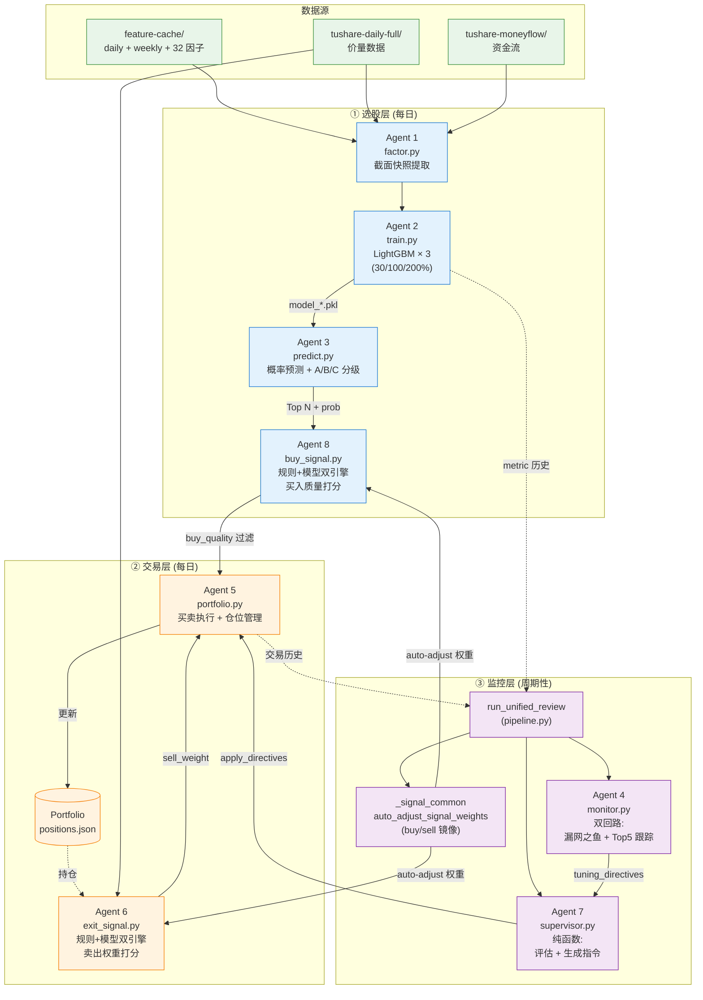

# Bull Hunter v6 — 大牛股预测系统

> 6 Agent 三层架构：选股层 (1+2+3+8) → 交易层 (5+6) → 监控层 (统一复盘)
> 目标：找到未来 2 周涨 30%、2 月翻倍、6 月涨 200% 的股票

---

## 核心思路

v6 三层架构：**选股层** (1+2+3+8) → **交易层** (5+6) → **监控层** (统一复盘)。
选股层产出每日 Top N 候选 + 买入质量分；交易层执行买卖并管理组合；监控层周期性
复盘并通过 `auto_adjust` 自适应调权。



**关键数据流**

| 边 | 频率 | 内容 |
|---|------|------|
| Agent 1 → 2 → 3 | 训练日（默认每周） | 因子 panel → 模型 → 概率 |
| Agent 3 → 8 → 5 | 每日 | Top N → buy_quality 过滤 → 实际下单 |
| Agent 6 → 5 | 每日 | 持仓的 sell_weight，触发卖出 |
| Agent 4 → 7 → 5 | 复盘日（默认每 N 天） | 选股层调参指令 |
| `_signal_common` → 6/8 | 复盘日 | Spearman 自适应权重 |

与状态机策略 (`entropy_accumulation_breakout`) 的区别：

| 维度 | 状态机 (v1) | Bull Hunter (v6) |
|------|------------|-----------------|
| 方法 | 规则：惜售→突破→崩塌三阶段 | 模型：LightGBM 二分类器 + 规则双引擎 |
| 目标 | 单一（突破信号） | 三个独立目标（30%/100%/200%） |
| 评级 | 无分级 | A(大牛)/B(翻倍)/C(短线) |
| 退出 | 崩塌检测 | Agent 6 sell_weight + 止损 + 自适应阈值 |
| 持仓管理 | 无 | Agent 5 完整组合管理 |
| 信号密度 | 极低（强过滤） | 高（每日 Top N） |

## 三个目标

| 目标 | 标签定义 | 前瞻窗口 | 含义 |
|------|---------|---------|------|
| `30pct` | 涨幅 ≥ 30% | 10 个交易日 (2 周) | 短线爆发 |
| `100pct` | 涨幅 ≥ 100% | 40 个交易日 (2 月) | 翻倍牛 |
| `200pct` | 涨幅 ≥ 200% | 120 个交易日 (6 月) | 超级大牛 |

## 32 个因子

| 类别 | 因子 | 数量 |
|------|------|------|
| 熵指标 | `perm_entropy_{s,m,l}`, `entropy_slope`, `entropy_accel`, `path_irrev_{m,l}`, `dom_eig_{m,l}` | 9 |
| 换手率熵 | `turnover_entropy_{m,l}` | 2 |
| 波动率 | `volatility_{m,l}`, `vol_compression`, `bbw_pctl`, `vol_ratio_s`, `vol_impulse`, `vol_shrink`, `breakout_range` | 8 |
| 资金流 | `mf_big_net`, `mf_big_net_ratio`, `mf_big_cumsum_{s,m,l}`, `mf_sm_proportion`, `mf_flow_imbalance`, `mf_big_momentum`, `mf_big_streak` | 9 |
| 密度矩阵 | `coherence_l1`, `purity_norm`, `von_neumann_entropy`, `coherence_decay_rate` | 4 |

## 文件结构

| 文件 | 层 | 职责 |
|------|----|------|
| `agent1_factor.py` | 选股 | 增量因子检查 + 全市场截面快照提取 |
| `agent2_train.py` | 选股 | 构建训练 panel + 训练 3 个 LightGBM 分类器 |
| `agent3_predict.py` | 选股 | 全市场概率预测 + A/B/C 分层评级 |
| `agent8_buy_signal.py` | 选股 | 规则+模型双引擎打分，过滤 Agent 3 的 Top N |
| `agent5_portfolio.py` | 交易 | 买卖执行、仓位管理、止损 |
| `agent6_exit_signal.py` | 交易 | 规则+模型双引擎计算每只持仓的 sell_weight |
| `portfolio.py` | 交易 | Portfolio 数据类 (positions / cash / 持仓快照) |
| `agent4_monitor.py` | 监控 | 双回路评估：漏网之鱼分析 + Top 5 跟踪 |
| `agent7_supervisor.py` | 监控 | 纯函数集合：评估 + 生成 directives + apply_directives |
| `_signal_common.py` | 共享 | Agent 6/8 公共 IO + auto_adjust_signal_weights |
| `tracker.py` | 监控 | 历史预测的到期评估 |
| `pipeline.py` | 编排 | `run_scan` / `run_live` / `run_live_backtest` / `run_unified_review` |
| `run_bull_hunter.py` | CLI | argparse 入口 (`--daily`/`--train`/`--review`/`--live`/`--live-backtest`/`--backtest`) |

## 使用方法

### 单日扫描

```bash
python -m src.strategy.factor_model_selection.v3_bull_hunter.run_bull_hunter \
    --scan_date 20260419
```

### 滚动回测 (带实际收益验证)

```bash
python -m src.strategy.factor_model_selection.v3_bull_hunter.run_bull_hunter \
    --backtest \
    --start_date 20250301 \
    --end_date 20251230 \
    --interval_days 20 \
    --top_n 10
```

### 自定义参数

```bash
python -m src.strategy.factor_model_selection.v3_bull_hunter.run_bull_hunter \
    --scan_date 20260419 \
    --lookback_months 12 \
    --n_estimators 800 \
    --learning_rate 0.03 \
    --top_n 20
```

## 数据依赖

共享 `entropy_accumulation_breakout` 的特征引擎和缓存：

```
/gp-data/feature-cache/
├── daily/{symbol}.csv       ← 日线特征 (32 因子, ~5000 只股票)
├── weekly/{symbol}.csv      ← 周线特征
└── bull_models/{scan_date}/ ← 本策略训练的模型
    ├── model_30pct.pkl
    ├── model_100pct.pkl
    ├── model_200pct.pkl
    └── meta.json            ← AUC/precision/recall/best_threshold/特征重要性
```

## 训练配置

| 参数 | 默认值 | 说明 |
|------|--------|------|
| `lookback_months` | 12 | 回看月数 |
| `sample_interval_days` | 5 | 采样间隔 (天) |
| `n_estimators` | 800 | LightGBM 树数 |
| `learning_rate` | 0.03 | 学习率 |
| `max_depth` | 5 | 最大深度 |
| `max_scale_pos_weight` | 5.0 | 类别权重上限 |
| `val_ratio` | 0.2 | 验证集比例 (时间末尾) |

**关键设计决策**:
- **不用 Early Stopping**: 极端不平衡 (正样本 < 1%) 下，val loss 从第 1 棵树就单调递增，early stopping 会在 iteration=1 停止。依赖正则化防过拟合
- **scale_pos_weight 上限 5.0**: 原始比例 ~200:1，若不截断会导致第一棵树过拟合
- **时间分割验证**: 最后 20% 样本为验证集 (按时间顺序，非随机)
- **F1 最优阈值搜索**: 正样本极稀少时固定 0.5 不合理，搜索 [0.01, 0.50] 找最优 F1

## 回测结果 (2025-03 ~ 2025-12)

11 次滚动扫描, 301 条预测:

| 等级 | 预测数 | 10d 均值 | 10d 胜率 | 40d 均值 | 40d 胜率 | 120d 均值 | 120d 胜率 |
|------|--------|----------|----------|----------|----------|-----------|-----------|
| A (大牛) | 81 | +3.8% | 57% | +6.0% | 58% | +32.7% | 76% |
| B (翻倍) | 110 | +2.1% | 60% | +9.2% | 63% | +31.7% | 74% |
| C (短线) | 110 | +2.0% | 52% | +7.7% | 57% | +21.2% | 72% |
| ALL | 301 | +2.5% | 56% | +7.8% | 60% | +28.0% | 74% |

## 输出文件

```
results/bull_hunter/
├── {scan_date}/
│   ├── predictions.csv      ← 候选列表 (symbol, prob_30/100/200, grade)
│   └── health_report.json   ← 模型健康状态 + 调参建议
└── backtest_{start}_{end}/
    ├── backtest_detail.csv   ← 每条预测 + 实际涨幅
    ├── backtest_summary.csv  ← 按等级汇总
    └── backtest_by_date.csv  ← 按扫描日汇总
```
